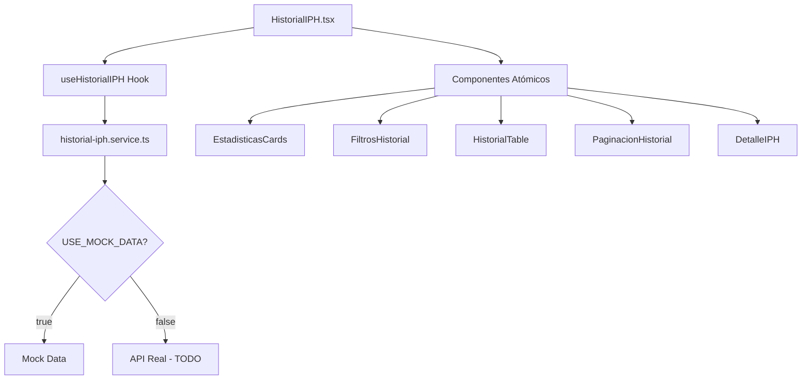

# Componente HistorialIPH

## Descripción General

El componente **HistorialIPH** es una aplicación completa para la gestión y visualización del historial de Informes Policiales Homologados (IPH). Implementa una arquitectura moderna con TypeScript, componentes atómicos, hooks personalizados y un sistema de servicios adaptable que actualmente funciona con datos mock pero está preparado para integración con APIs reales.

## Características Principales

- ✅ **TypeScript completo** con interfaces tipadas
- ✅ **Arquitectura de componentes atómicos** siguiendo principios SOLID
- ✅ **Hook personalizado** para separación de lógica y presentación
- ✅ **Sistema de servicios mock** con documentación JSDoc TODO para API real
- ✅ **Control de acceso basado en roles** (Admin/SuperAdmin únicamente)
- ✅ **Filtros avanzados** con rangos de fecha, estatus, tipos de delito
- ✅ **Paginación completa** con navegación intuitiva
- ✅ **Vista de detalle dummy** preparada para futura implementación
- ✅ **Sistema de estadísticas** en tiempo real
- ✅ **Estados de carga y error** con UI apropiada
- ✅ **Accesibilidad mejorada** con ARIA labels y navegación por teclado
- ✅ **Diseño responsivo** optimizado para móviles y desktop
- ✅ **Logging completo** de eventos y acciones
- ✅ **Notificaciones integradas** para feedback del usuario

## Estructura de Archivos

```
src/components/private/components/historial-iph/
├── HistorialIPH.tsx                 # Componente principal
├── README.md                        # Esta documentación
│
├── hooks/
│   └── useHistorialIPH.ts          # Hook personalizado con lógica de negocio
│
├── components/
│   ├── FiltrosHistorial.tsx        # Filtros avanzados
│   ├── PaginacionHistorial.tsx     # Paginación específica
│   └── DetalleIPH.tsx              # Vista detalle dummy
│
├── cards/
│   └── EstadisticasCards.tsx       # Tarjetas de estadísticas
│
└── table/
    └── HistorialTable.tsx          # Tabla principal de registros

# Archivos de soporte
src/
├── interfaces/components/
│   └── historialIph.interface.ts   # Interfaces TypeScript
│
├── services/historial/
│   └── historial-iph.service.ts    # Servicio adaptable con mocks
│
└── mock/historial-iph/
    ├── index.ts                     # Barrel export
    ├── registros.mock.ts           # Datos mock de registros
    └── estadisticas.mock.ts        # Datos mock de estadísticas
```

## Funcionamiento del Componente

### 1. Arquitectura y Flujo de Datos



### 2. Hook Personalizado - useHistorialIPH

El hook encapsula toda la lógica de negocio:

```typescript
const {
  // Estado
  registros,
  estadisticas,
  loading,
  error,
  filtros,
  paginacion,
  registroSeleccionado,
  
  // Acciones
  setFiltros,
  setCurrentPage,
  refetchData,
  clearError,
  verDetalle,
  cerrarDetalle,
  editarEstatus,
  
  // Navegación
  canGoToNextPage,
  canGoToPreviousPage,
  goToNextPage,
  goToPreviousPage,
  hasData
} = useHistorialIPH({
  initialFilters,
  itemsPerPage
});
```

**Responsabilidades del Hook:**
- Gestión de estado completo
- Control de acceso basado en roles
- Integración con servicios
- Manejo de errores y loading states
- Logging de eventos
- Retry logic con backoff exponencial

### 3. Sistema de Servicios Mock

El servicio actual funciona con datos mock pero incluye documentación completa JSDoc TODO para implementación real:

```typescript
// Configuración actual
const USE_MOCK_DATA = true; // TODO: Cambiar a false cuando el API esté disponible

// Función principal
export const getHistorialIPH = async (params: GetHistorialIPHParams): Promise<HistorialIPHResponse> => {
  if (USE_MOCK_DATA) {
    return await getHistorialMock(params);
  } else {
    return await getHistorialFromAPI(params); // TODO: Implementar
  }
};
```

**Funciones Disponibles:**
- `getHistorialIPH()` - Obtiene registros con filtros y paginación
- `updateEstatusIPH()` - Actualiza el estatus de un registro
- `getRegistroIPHById()` - Obtiene un registro específico
- `getEstadisticasHistorial()` - Obtiene estadísticas generales

### 4. Control de Acceso por Roles

El componente implementa validación estricta de roles:

```typescript
// Solo Admin y SuperAdmin pueden acceder
const allowedRoleNames = ['Administrador', 'SuperAdmin'];
const hasPermission = userRoles.some((role: any) => 
  allowedRoleNames.includes(role.nombre)
);
```

**Comportamiento por Rol:**
- **SuperAdmin/Admin**: Acceso completo, puede ver y editar todos los registros
- **Superior/Elemento**: Acceso denegado con mensaje informativo
- **Sin autenticación**: Redirección automática

### 5. Sistema de Filtros Avanzados

Los filtros permiten búsquedas precisas:

**Filtros Básicos:**
- Búsqueda general (texto libre)
- Estatus (Activo, Inactivo, Pendiente, Cancelado)
- Tipo de delito (selector con opciones predefinidas)
- Usuario responsable

**Filtros Avanzados:**
- Rangos de fecha personalizados
- Botones de rango rápido (Hoy, Esta semana, Este mes, Mes pasado)
- Combinación múltiple de filtros

### 6. Vista de Detalle Dummy

La vista de detalle incluye pestañas con información completa:

**Pestaña General:**
- Información básica del caso
- Datos de ubicación completos
- Personas involucradas (víctimas, testigos)
- Observaciones editables

**Pestaña Evidencias (Dummy):**
- Lista de evidencias con tipos (Foto, Video, Documento)
- Funciones de visualización y descarga (placeholder)

**Pestaña Seguimiento (Dummy):**
- Timeline de acciones realizadas
- Historial de cambios de estatus
- Registro de usuarios involucrados

**Pestaña Documentos (Dummy):**
- Documentos oficiales adjuntos
- Reportes generados
- Archivos de soporte

## Uso del Componente

### Implementación Básica

```typescript
import HistorialIPH from './components/private/components/historial-iph/HistorialIPH';

// Uso básico
<HistorialIPH />

// Con configuración personalizada
<HistorialIPH
  className="custom-class"
  itemsPerPage={15}
  initialFilters={{
    estatus: 'Activo',
    fechaInicio: '2024-01-01'
  }}
/>
```

### Props Disponibles

```typescript
interface HistorialIPHProps {
  className?: string;                    // Clases CSS adicionales
  initialFilters?: Partial<FiltrosHistorial>; // Filtros iniciales
  itemsPerPage?: number;                 // Registros por página (default: 10)
}
```

### Integración en Rutas

```typescript
// En IPHApp.tsx o router principal
import HistorialIPH from './components/private/components/historial-iph/HistorialIPH';

<Route 
  path="/historial-iph" 
  element={<HistorialIPH />} 
/>
```

## Estados del Componente

### 1. Estado de Carga
- Skeleton loader para tabla
- Spinners en botones y filtros
- Overlay de carga para actualizaciones

### 2. Estado Sin Datos
- Icono descriptivo
- Mensaje informativo
- Botones de acción (Reintentar, Limpiar filtros)

### 3. Estado de Error
- Banner de error con detalles
- Opciones para ocultar o reintentar
- Logging automático de errores

### 4. Estado Sin Permisos
- Mensaje de acceso restringido
- Información sobre roles requeridos
- Diseño centrado y profesional

## Datos Mock Incluidos

### Registros de Ejemplo
- **15 registros** con datos realistas
- **Diferentes tipos de delito**
- **Varios estatus** (Activo, Inactivo, Pendiente, Cancelado)
- **Fechas variadas** para testing de filtros
- **Usuarios diversos** para filtrado

### Estadísticas Calculadas
- Total de registros
- Conteos por estatus
- Registros del mes actual
- Promedio diario

### Datos de Detalle Dummy
- Información completa de ubicación
- Personas involucradas (víctimas, testigos)
- Evidencias simuladas (fotos, videos, documentos)
- Timeline de seguimiento

## Integración con Arquitectura Existente

### Sistema de Roles
```typescript
// Integración con ALLOWED_ROLES del sistema
import { ALLOWED_ROLES } from '../../../../../config/env.config';

// Validación usando sessionStorage (migrado de localStorage)
const userDataStr = sessionStorage.getItem('userData');
```

### Sistema de Notificaciones
```typescript
// Integración con notification helper
import { showSuccess, showError, showWarning } from '../../../../../helper/notification/notification.helper';

// Uso en acciones
showSuccess('Datos actualizados correctamente');
showError('No se pudieron cargar los datos');
```

### Sistema de Logging
```typescript
// Integración con logger helper
import { logInfo, logError, logWarning } from '../../../../../helper/log/logger.helper';

// Logging estructurado
logInfo('HistorialIPH', 'Obteniendo datos del historial', { filtros, paginacion });
```

## Próximos Pasos para Implementación Real

### 1. Configuración del API

```typescript
// En historial-iph.service.ts
const USE_MOCK_DATA = false; // Cambiar a false

// Configurar endpoints reales
const HISTORIAL_ENDPOINTS = {
  GET_HISTORIAL: '/api/historial',
  GET_ESTADISTICAS: '/api/historial/estadisticas',
  UPDATE_ESTATUS: '/api/historial/estatus',
  GET_DETALLE: '/api/historial'
};
```

### 2. Implementar Funciones API

Todas las funciones tienen documentación JSDoc TODO completa:
- `getHistorialFromAPI()` - GET /api/historial
- `updateEstatusFromAPI()` - PUT /api/historial/estatus
- Headers de autenticación
- Manejo de errores HTTP
- Transformación de datos si necesario

### 3. Funcionalidades Avanzadas

**Por implementar:**
- Cache de consultas frecuentes
- Exportación a PDF/Excel
- Búsqueda full-text
- Filtros geográficos
- Notificaciones en tiempo real
- Audit trail completo

### 4. Optimizaciones

**Rendimiento:**
- Virtual scrolling para grandes datasets
- Debounce en filtros de texto
- Memoización de componentes pesados
- Lazy loading de detalles

## Consideraciones de Seguridad

### Validación de Roles
- Verificación en frontend Y backend
- Tokens de autenticación en headers
- Validación de permisos por operación

### Datos Sensibles
- No exposición de información confidencial en logs
- Sanitización de inputs
- Validación de parámetros

### Rate Limiting
- Preparado para implementar limits por usuario
- Retry logic con backoff exponencial
- Prevención de spam de requests

## Testing

### Datos de Prueba
Los mocks incluyen casos variados para testing:
- Diferentes combinaciones de filtros
- Paginación con diversos tamaños
- Estados de error simulados
- Datos edge case

### Casos de Uso Cubiertos
- ✅ Filtrado por todos los campos
- ✅ Paginación completa
- ✅ Cambio de estatus
- ✅ Vista de detalle
- ✅ Control de acceso por roles
- ✅ Manejo de errores
- ✅ Estados de carga

## Mantenimiento

### Logging y Debugging
Todos los eventos importantes están loggeados:
- Cargas de datos
- Cambios de filtros
- Errores de API
- Acciones de usuario

### Configuración
Variables centralizadas en:
- `USE_MOCK_DATA` para alternar entre mock y API real
- Timeouts y retry counts configurables
- Tamaños de página personalizables

### Actualización de Mocks
Los datos mock se pueden actualizar fácilmente en:
- `src/mock/historial-iph/registros.mock.ts`
- `src/mock/historial-iph/estadisticas.mock.ts`

---

## Conclusión

El componente **HistorialIPH** representa una implementación completa y profesional para la gestión de historiales de IPH, con arquitectura moderna, tipos seguros, y preparación completa para integración con APIs reales. Su diseño modular y bien documentado facilita el mantenimiento y la extensión de funcionalidades.

**Status actual:** ✅ **Completamente funcional con datos mock**  
**Status futuro:** ⏳ **Listo para integración con API real**

Para activar el API real, simplemente cambiar `USE_MOCK_DATA = false` en el servicio e implementar los endpoints documentados en los comentarios JSDoc TODO.