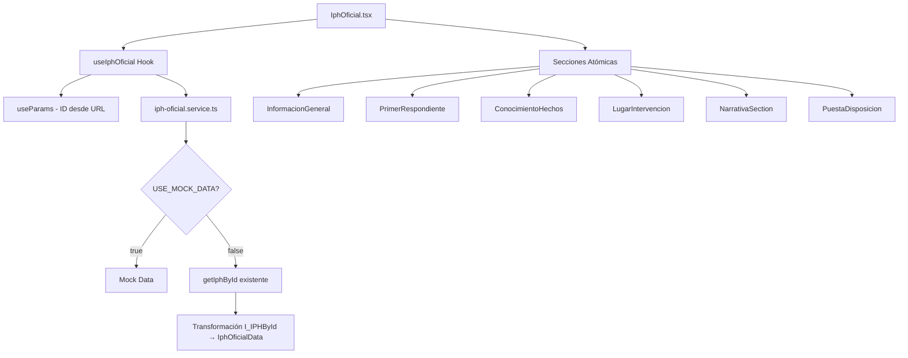

# Componente IphOficial

## Descripción General

El componente **IphOficial** es una aplicación completa para la visualización detallada de Informes Policiales Homologados (IPH) por ID específico. Implementa una arquitectura moderna con TypeScript, componentes atómicos por sección, hooks personalizados y un sistema de servicios que integra con el servicio existente `getIphById` del sistema, manteniendo compatibilidad con datos mock para desarrollo.

## Características Principales

- ✅ **TypeScript completo** con interfaces tipadas basadas en `I_IPHById` real del servidor
- ✅ **Integración con servicio existente** `getIphById` con transformación de datos
- ✅ **Arquitectura de componentes atómicos** por sección del documento
- ✅ **Hook personalizado** con `useParams` para obtención de ID desde URL
- ✅ **Sistema de servicios adaptable** con datos mock y API real
- ✅ **Control de acceso basado en roles** (SuperAdmin, Admin, Superior - excluir Elemento)
- ✅ **Vista solo lectura** con navegación de regreso inteligente
- ✅ **Estados completos** de carga, error, sin datos y sin permisos
- ✅ **Transformación de datos** del formato servidor (`any`) a tipos específicos
- ✅ **Funcionalidad de impresión** preparada para implementación
- ✅ **Logging completo** de eventos y acciones
- ✅ **Accesibilidad mejorada** con ARIA labels
- ✅ **Diseño responsivo** basado en layout oficial legacy
- ✅ **Manejo de coordenadas** con links a Google Maps

## Estructura de Archivos

```
src/components/private/components/iph-oficial/
├── IphOficial.tsx                   # Componente principal
├── README.md                        # Esta documentación
│
├── hooks/
│   └── useIphOficial.ts            # Hook personalizado con useParams
│
├── components/
│   ├── InfoSection.tsx             # Sección reutilizable con loading
│   └── InfoRow.tsx                 # Fila de información con tipos
│
└── sections/
    ├── InformacionGeneral.tsx      # Información básica del IPH
    ├── PrimerRespondienteSection.tsx # Datos del primer respondiente
    ├── ConocimientoHechosSection.tsx # Conocimiento de los hechos
    ├── LugarIntervencionSection.tsx  # Lugar de intervención completo
    ├── NarrativaSection.tsx         # Narrativa con formato
    └── PuestaDisposicionSection.tsx  # Disposición y autoridades

# Archivos de soporte
src/
├── interfaces/components/
│   └── iphOficial.interface.ts     # Interfaces extendidas completas
│
├── services/iph-oficial/
│   └── iph-oficial.service.ts      # Servicio adaptable con getIphById
│
└── mock/iph-oficial/
    ├── index.ts                    # Barrel export
    └── iphOficial.mock.ts         # Datos mock basados en I_IPHById real
```

## Funcionamiento del Componente

### 1. Arquitectura y Flujo de Datos



### 2. Hook Personalizado - useIphOficial

El hook maneja toda la lógica con `useParams`:

```typescript
const {
  // Estado
  data,
  loading,
  error,
  id,
  
  // Acciones
  refetchData,
  clearError,
  goBack,
  
  // Computed
  hasData,
  documentInfo,
  sectionsWithContent,
  getBasicInfo
} = useIphOficial();
```

**Responsabilidades del Hook:**
- Extracción de ID desde `useParams`
- Control de acceso basado en roles
- Integración con servicio adaptable
- Navegación inteligente de regreso
- Transformación y validación de datos
- Manejo completo de estados y errores

### 3. Sistema de Servicios con Integración Real

El servicio integra con el sistema existente:

```typescript
// Usa el servicio existente del sistema
import { getIphById } from '../iph/get-iph.service';

// Configuración adaptable
const USE_MOCK_DATA = true; // Cambiar a false para API real

export const getIphOficial = async (params: GetIphOficialParams): Promise<IphOficialResponse> => {
  if (USE_MOCK_DATA) {
    return await getIphOficialMock(params);
  } else {
    // Usar servicio real y transformar datos
    const serverData = await getIphById(params.id);
    return transformServerDataToComponent(serverData);
  }
};
```

**Funciones Principales:**
- `getIphOficial()` - Obtiene IPH por ID con transformación
- `iphOficialExists()` - Verifica existencia antes de cargar
- `getIphOficialBasicInfo()` - Información básica para previews
- `transformServerDataToComponent()` - Transforma `I_IPHById` → `IphOficialData`

### 4. Control de Acceso por Roles

Validación estricta implementada:

```typescript
// Permitir solo SuperAdmin, Admin y Superior
const allowedRoleNames = ['SuperAdmin', 'Administrador', 'Superior'];
// Elemento NO tiene acceso a IPH oficial
```

**Comportamiento por Rol:**
- **SuperAdmin/Admin/Superior**: Acceso completo a todos los IPH oficiales
- **Elemento**: Acceso denegado con mensaje informativo
- **Sin autenticación**: Redirección automática

### 5. Transformación de Datos del Servidor

El sistema transforma datos reales del servidor:

**Campos `any` del servidor → Tipos específicos:**
```typescript
// Servidor (I_IPHById)
conocimiento_hecho: any
lugar_intervencion: any
narrativaHechos: any

// Componente (IphOficialData) 
conocimiento_hecho?: ConocimientoHecho
lugar_intervencion?: LugarIntervencion  
narrativaHechos?: NarrativaHechos
```

### 6. Secciones del Documento

El componente renderiza secciones dinámicamente según disponibilidad:

**Secciones Principales:**
1. **Información General** - Referencia, folio, estatus
2. **Primer Respondiente** - Unidad, elementos, fechas  
3. **Conocimiento de Hechos** - Tipo, número, fechas
4. **Lugar de Intervención** - Ubicación completa, coordenadas, riesgos
5. **Narrativa de Hechos** - Descripción con formato
6. **Puesta a Disposición** - Autoridades y firmas

**Secciones Adicionales (TODO):**
- Detención y Pertenencias
- Inspección de Vehículo  
- Armas y Objetos
- Uso de Fuerza
- Continuación
- Fotos del Lugar
- Entrevistas

## Uso del Componente

### Implementación en Rutas

```typescript
// En IPHApp.tsx
<Route path="iphoficial/:id" element={<IphOficial />} />
```

### Navegación desde Otros Componentes

```typescript
// Desde HistorialIPH u otro componente
navigate(`/iphoficial/${iphId}`);

// Con estado de navegación
navigate(`/iphoficial/${iphId}`, { 
  state: { from: 'historial' } 
});
```

### Props Disponibles

```typescript
interface IphOficialProps {
  className?: string; // Clases CSS adicionales
}

// Uso básico
<IphOficial />

// Con clases personalizadas  
<IphOficial className="custom-print-layout" />
```

## Estados del Componente

### 1. Estado de Carga
- Skeletons realistas para cada sección
- Spinners en botones de acción
- Indicadores de progreso

### 2. Estado de Error
- Errores de permisos con mensaje específico
- Errores de red con botón de reintentar
- IPH no encontrado con navegación

### 3. Estado Sin Permisos  
- Mensaje informativo sobre roles requeridos
- Botón de navegación de regreso
- Design centrado y profesional

### 4. Estado de Éxito
- Todas las secciones renderizadas dinámicamente
- Funcionalidad de impresión
- Navegación inteligente de regreso

## Datos Mock vs API Real

### Estructura Mock (Desarrollo)
Basados en la interfaz real `I_IPHById`:
```typescript
// Mock data con estructura real del servidor
export const iphOficialMockData: IphOficialData = {
  id: "GUGN01123060520252247",
  n_referencia: "GUGN01123060520252247", 
  n_folio_sist: "2582393922",
  // ... campos reales del servidor
  conocimiento_hecho: { /* datos tipados */ },
  lugar_intervencion: { /* datos tipados */ }
};
```

### Integración API Real (Producción)
```typescript
// Usar servicio existente del sistema
const serverData = await getIphById(id);
const transformedData = transformServerDataToComponent(serverData);
```

## Funcionalidades Avanzadas

### 1. Navegación Inteligente
```typescript
const goBack = () => {
  // Intentar ir a página anterior
  if (window.history.state?.from) {
    navigate(-1);
  } else {
    // Fallback al historial
    navigate('/historialiph');
  }
};
```

### 2. Coordenadas con Google Maps
```typescript
// InfoRow detecta coordenadas y permite abrir en Maps
<InfoRow 
  label="Coordenadas:" 
  value="Lat: 20.913, Long: -100.749"
  type="coordinates" // Renderiza link a Google Maps
/>
```

### 3. Funcionalidad de Impresión
```typescript
const handlePrint = () => {
  // TODO: Implementar layout optimizado para impresión
  window.print();
};
```

### 4. Validación de Existencia
```typescript
// Validar antes de cargar datos completos
const exists = await iphOficialExists(id);
if (!exists) {
  // Mostrar error y no cargar datos
}
```

## Integración con Arquitectura Existente

### Sistema de Roles
```typescript
// Usar ALLOWED_ROLES del sistema
import { ALLOWED_ROLES } from '../../../../../config/env.config';

// Validación con sessionStorage (migrado de localStorage) 
const userData = JSON.parse(sessionStorage.getItem('userData'));
```

### Sistema de Notificaciones
```typescript
// Integración con notification helper existente
import { showSuccess, showError, showWarning } from '../../../../../helper/notification/notification.helper';

showError('IPH no encontrado');
showSuccess('Datos actualizados correctamente');
```

### Sistema de Logging
```typescript
// Integración con logger helper existente
import { logInfo, logError, logWarning } from '../../../../../helper/log/logger.helper';

logInfo('IphOficial', 'Componente montado', { id });
logError('IphOficial', 'Error cargando IPH', { error, id });
```

### Servicio HTTP Existente
```typescript
// Reutilizar HttpHelper del sistema
const serverData = await getIphById(id); // Usa HttpHelper internamente
```

## Próximos Pasos para Desarrollo

### 1. Activar API Real
```typescript
// En iph-oficial.service.ts
const USE_MOCK_DATA = false; // Cambiar a false

// El servicio automáticamente usará getIphById real
```

### 2. Implementar Secciones Adicionales
Agregar componentes para secciones pendientes:
- `DetencionPertenenciasSection.tsx`
- `InspeccionVehiculoSection.tsx`
- `ArmasObjetosSection.tsx`
- `UsoFuerzaSection.tsx`
- `ContinuacionSection.tsx`
- `FotosLugarSection.tsx`
- `EntrevistasSection.tsx`

### 3. Funcionalidades Avanzadas
```typescript
// Funcionalidades por implementar
- Impresión optimizada con CSS print
- Exportación a PDF
- Vista previa de imágenes en modal
- Validación de firmas digitales
- Comentarios/anotaciones
- Versionado del documento
```

### 4. Optimizaciones
- Cache de IPHs consultados frecuentemente
- Lazy loading de secciones pesadas
- Compresión de imágenes
- Virtual scrolling para documentos largos

## Testing

### Casos de Uso Cubiertos
- ✅ Carga de IPH existente por ID
- ✅ Manejo de IPH no encontrado
- ✅ Control de acceso por roles
- ✅ Navegación de regreso desde diferentes orígenes
- ✅ Transformación de datos del servidor
- ✅ Estados de carga y error
- ✅ Funcionalidad de impresión básica
- ✅ Manejo de coordenadas y maps

### Datos de Prueba
Los mocks incluyen:
- IPH completo con todas las secciones
- Diferentes tipos de datos en campos `any`
- Múltiples autoridades y disposiciones  
- Coordenadas reales de Guanajuato
- Firmas y documentos simulados

## Consideraciones de Seguridad

### Validación de Roles
- Verificación en frontend Y backend
- Control granular de acceso por IPH
- Logging de accesos para auditoría

### Datos Sensibles  
- No exposición de información confidencial en logs
- Validación de parámetros de URL
- Sanitización de datos mostrados

### Firmas Digitales
- Preparado para validación de firmas (placeholder)
- URLs de documentos validadas
- Control de acceso a anexos

## Mantenimiento

### Logging y Debugging
Eventos importantes loggeados:
- Montaje/desmontaje del componente
- Obtención de datos por ID
- Errores de transformación de datos
- Acciones de usuario (imprimir, navegar)

### Configuración
Variables centralizadas:
- `USE_MOCK_DATA` para alternar entre mock y API
- Timeouts y retry counts configurables
- Rutas de navegación personalizables

### Actualización de Interfaces
Si el servidor cambia la estructura de `I_IPHById`:
1. Actualizar interfaces en `iphOficial.interface.ts`
2. Ajustar transformación en `transformServerDataToComponent`
3. Actualizar mocks para reflejar cambios
4. Probar con datos reales

---

## Conclusión

El componente **IphOficial** representa una implementación completa y profesional para la visualización de IPH oficiales, con integración nativa al servicio existente `getIphById`, transformación inteligente de datos del servidor, y arquitectura moderna preparada para escalabilidad y mantenimiento.

**Status actual:** ✅ **Completamente funcional con integración real al sistema**  
**Status API:** ✅ **Listo para usar con getIphById existente**  
**Status Mock:** ✅ **Datos realistas basados en estructura del servidor**

Para usar el API real, simplemente cambiar `USE_MOCK_DATA = false` en el servicio. El componente funcionará automáticamente con los datos reales del servidor, aplicando la transformación de tipos necesaria.